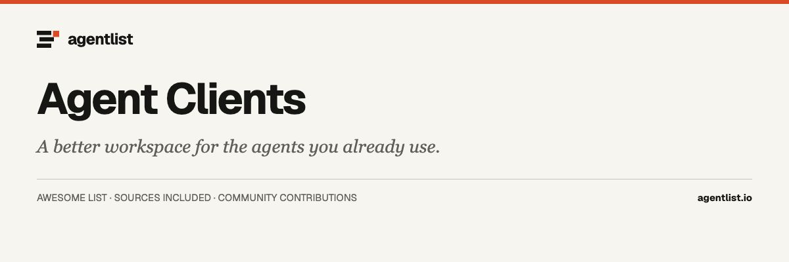

  

# Awesome Agent Clients

  

> Desktop, terminal, mobile, and web clients for coding agents, organized by how you work.

45 projects · Upstream documentation checked 2026-09-30. Curated by [agentlist.io](https://www.agentlist.io).

**Bring your own agent. Find a better way to work with it.**

You already have a coding agent. The next question is how you want to work with it: review changes in a desktop workspace, steer a session from your phone, or keep several projects moving from a terminal. Start with the agent you use and the task you want to make easier.

Interfaces that run, steer, review, or resume an existing coding-agent harness. General chat frontends and standalone agent frameworks belong elsewhere.

## Practical guides

- [Control and review coding agents from your phone](guides/control-coding-agents-from-your-phone.md) — compare native remote access, Happy, and CloudCLI; check execution location, approvals, and session continuity.

## Contents

- [How to choose](#how-to-choose)
- [Decision table](#decision-table)
- [Desktop and project workspaces](#desktop-and-project-workspaces)
- [Mobile and remote access](#mobile-and-remote-access)
- [Terminal and session navigation](#terminal-and-session-navigation)
- [Editor integrations](#editor-integrations)
- [Team and multi-agent control planes](#team-and-multi-agent-control-planes)
- [Related awesome lists](#related-awesome-lists)
- [More from Agentlist](#more-from-agentlist)
- [Contributing](#contributing)

## How to choose

- Works with: Does it support your existing agent, login method, and operating system? A transcript viewer and a client that can start or steer work offer different capabilities.
- Runs where: Where does the interface run, and where does the agent execute? A local desktop app can still depend on cloud services.
- Needs access to: Which repositories, files, credentials, and remote connections must you give it?
- Keeps what: Can you resume sessions, inspect changes, and export history? What remains available if you switch clients?
- Human involvement: Can you approve actions and review results? Does background work continue when you close the interface?
- Main limitation: What would rule it out for your setup: agent support, platform support, remote access, or missing review controls?

Use these questions to narrow your shortlist. An entry’s source link records the documentation used for its description; it does not mean every question above has been answered or tested. Treat undocumented capabilities as unknown, and confirm requirements against the linked project before adopting it.

## Decision table

Rows are situations a cited page can separate. A project missing from a row is still in the catalog below. Unresolved means the cited page does not say.

| When you need | Documented fit | What the docs separate | Unresolved | Source |
| --- | --- | --- | --- | --- |
| A phone or remote UI while the agent stays on the computer that has the CLI | Happy, CodexMonitor, Orca, and Paseo use a phone or browser while the CLI stays on that computer. | Happy's README says you run happy claude or happy codex on the computer, then the phone restarts that session in remote mode. The phone does not host the agent. | Unknown: the Happy README does not say whether the wrapper keeps running if that computer sleeps. | [source](https://github.com/slopus/happy) |
| Review saved transcripts, or start and steer an agent | Agent Sessions reads local transcripts and can resume some CLIs. opcode and claudecode.nvim start or steer Claude Code. | The Agent Sessions README lists OpenClaw, Cline, and DeepSeek Harness as browse-only, with no resume. Supported resumes copy a command or open Terminal, iTerm2, or Warp. | Unknown: the README marks Qwen Code end-to-end resume and fx interactive reopen as unverified. | [source](https://github.com/jazzyalex/agent-sessions) |
| Claude Code only, or several installed CLIs | opcode and claudecode.nvim are Claude Code clients. Vibe Kanban and Cline Kanban start several installed CLIs. | The opcode README is a desktop GUI for Claude Code sessions and for custom agents that still use Claude models. Vibe Kanban's README names Claude Code, Codex, Gemini CLI, Copilot, Cursor, and OpenCode. | Cited page covers this for opcode. It does not say whether a custom agent can launch a non-Claude CLI. | [source](https://github.com/winfunc/opcode) |
| A branch or worktree for each agent | Vibe Kanban, Cline Kanban, and Sculptor give each task its own branch or worktree. | Vibe Kanban gives the agent a branch, a terminal, and a dev server. Cline Kanban creates an ephemeral git worktree per card. Sculptor's README calls a workspace an isolated copy of your code. | Unknown: the Vibe Kanban README does not say whether two agents can share one branch. | [source](https://github.com/BloopAI/vibe-kanban) |
| An editor plugin, or a separate app | claudecode.nvim runs inside Neovim. opcode and Toad are separate apps, one desktop and one terminal UI. | claudecode.nvim starts the Claude Code CLI from a split in Neovim and shows proposed edits as Neovim diffs. opcode and Toad are apps you launch outside the editor. | Unknown: the claudecode.nvim README does not say whether the CLI keeps running after Neovim quits. | [source](https://github.com/coder/claudecode.nvim) |
| A terminal UI that owns existing CLI processes | herdr owns the terminals of CLIs you already run. Toad launches agents through the Agent Client Protocol. | The herdr README says it does not wrap or replace those agents and instead owns their terminals, with panes marked working, blocked, or idle. The background server keeps running when the client closes. | Unknown: after a restart the original processes do not survive, and the README does not list which sessions can resume. | [source](https://github.com/herdrdev/herdr) |
| A team board over installed harnesses | Vibe Kanban and Cline Kanban run installed CLIs from a kanban. They do not replace the harness. | Vibe Kanban plans on a board and starts an installed CLI in a workspace with a branch and terminal. Cline Kanban detects the installed CLI and gives every card its own terminal and worktree. | Unknown: the Cline Kanban README says it launches the CLI it finds, but does not list every supported name. | [source](https://github.com/cline/kanban) |
| Vibe Kanban's sunset versus boards that do not announce one | Vibe Kanban's company is shutting down. Cline Kanban's README does not announce a sunset. | The announcement says the repo stays open source and community maintained, the current version can export data, and remote services for issues, comments, projects, and organisations remain 30 days, then the app is local-only. | Unknown: the announcement states a 30-day remote window and gives no calendar date. | [source](https://www.vibekanban.com/blog/shutdown) |
| Where the agent runs if Proliferate's control plane is remote | Proliferate documents a macOS app and a self-hosted control plane. Happy starts the agent on your computer. | The README says Proliferate runs each agent through its native harness and that the desktop app can point at a Docker or cloud control plane. It never names the machine that then executes the agent. | Unknown: a remote control plane is documented, but not which machine executes the agent. | [source](https://github.com/proliferate-ai/proliferate) |
| How claudecode.nvim connects Neovim to Claude Code | claudecode.nvim starts the Claude Code CLI and connects it to a WebSocket server the plugin creates. | The README says the plugin creates that WebSocket server on a random port, writes a lock file in the Claude ide directory, and sets environment variables so the Claude Code CLI can connect. | Unknown: the README does not say whether that WebSocket server listens only on localhost. | [source](https://github.com/coder/claudecode.nvim) |
| Whether a client documents an export format for sessions | Vibe Kanban's current version can export data. AionUi, CodexMonitor, Toad, and Happy do not document one here. | The shutdown post says the latest version includes a data export feature. Export-only sentences were removed from other client entries so this row holds that shared gap. | Unknown: this pass did not re-open every README that lost an export sentence, so a documented format could still exist. | [source](https://www.vibekanban.com/blog/shutdown) |

## Desktop and project workspaces

- [AionUi](https://github.com/iOfficeAI/AionUi) - Desktop cowork app for macOS, Windows, and Linux that can use a built-in agent or attach installed CLIs such as Claude Code, Codex, Gemini CLI, and OpenCode. The interface runs locally, with an optional web UI and chat-app gateways, while each agent executes on that machine and gets its own permission dialog; team mode shares one folder, and an unattended mode exists only when the selected agent exposes it. **Desktop app.**
- [CodeNomad](https://github.com/NeuralNomadsAI/CodeNomad) - Desktop and browser workspace aimed at OpenCode V2. Desktop builds bundle Node.js and connect to a shared OpenCode background service, so closing a window leaves that service and its sessions running; a password-protected server can be opened from a browser, with HTTPS on by default, Git has to be on the backend PATH for worktrees, and OpenCode V1 is not supported. **OpenCode client.**
- [CodexMonitor](https://github.com/Dimillian/CodexMonitor) - Tauri app that starts one Codex app-server per workspace, resumes threads, and shows approval prompts, diffs, and git state from that protocol. The desktop app is local-first on macOS, Linux, and Windows unless you enable a remote daemon; the README calls iOS support in progress and says the daemon must stay running for a phone to connect. **Codex client.**
- [Nimbalyst](https://github.com/nimbalyst/nimbalyst) - Desktop workspace for macOS, Windows, and Linux that runs Codex and Claude Code, with OpenCode and GitHub Copilot marked alpha and a Gemini provider also listed, each session in its own git worktree. You and the agent edit the same markdown, mockups, and diagrams and can accept or reject edits in a rendered diff; an iOS companion can answer, review diffs, and queue tasks while the agents stay on the desktop, content is plain files in the repo so there is no separate store to export, and the README adds no isolation boundary beyond those worktrees. **Desktop app.**
- [opcode](https://github.com/winfunc/opcode) - Tauri desktop app for browsing and resuming Claude Code sessions stored under the Claude projects directory on Windows, macOS, and Linux. It can also run custom agents in separate processes, with file and network access set per agent, and the README says usage data can be exported and that other app data stays on the machine; it talks to the Claude Code CLI rather than to other vendors' agents, and the README does not describe a sandbox beyond separate processes. **Claude Code client.**
- [OpenChamber](https://github.com/openchamber/openchamber) - Workspace for running and reviewing OpenCode sessions from desktop, a browser, VS Code, or iOS and Android. Desktop builds bundle a matching OpenCode CLI, the other surfaces use one you already installed, and a session can continue after you close the app; pairing can use a private relay the README calls end-to-end encrypted, or a direct, LAN, tunnel, or SSH path, you review diffs and GitHub comments in the UI, and the README says the project is not affiliated with the OpenCode team. **OpenCode client.**
- [OpenWork](https://github.com/different-ai/openwork) - Desktop app for macOS, Windows, and Linux, built on OpenCode, for working on local files with your own model keys or a local model. The same skills and connections can be exposed to Codex, Claude Code, or Cursor through one OpenWork MCP, and the README says local use does not require an OpenWork account while cloud and the Den org control plane are optional; it also says paths outside ee/ are MIT, paths under ee/ are the OpenWork EE License, and earlier releases remain under FSL-1.1-MIT. **Desktop app.**
- [Vibe Kanban](https://github.com/BloopAI/vibe-kanban) - Local web app, launched with npx in a git repository, for planning on a kanban board and running installed CLIs such as Claude Code, Codex, Gemini CLI, Copilot, Cursor, and OpenCode; each workspace gives that agent a branch, a terminal, and a dev server on the machine running the app, and you review the diff in the UI. The README says the project is sunsetting: the company is shutting down, the repository stays open source and community maintained, the current version can export data, and remote services for issues, comments, projects, and organisations remain for 30 days before the app becomes local-only. **Agent workbench.**
- [Orca](https://github.com/stablyai/orca) - Desktop app for macOS, Windows, and Linux, with iOS and Android companions, that runs terminal agents such as Codex, Claude Code, OpenCode, and Pi side by side. Each task gets its own git worktree and terminal on the machine you pick, including a remote host over SSH, and you can comment on a diff and send that comment back to the agent; the phone apps monitor and steer the desktop session rather than hosting the agents. **Desktop app.**
- [T3 Code](https://github.com/pingdotgg/t3code) - Electron desktop app, local web app, and iOS and Android clients that control harnesses already set up on your computer: Codex, Claude Code, Cursor, Grok Build, OpenCode, and Antigravity. The t3 server on that computer starts the agents, can keep running as a background service, and the README points to permission modes and remote access without describing where transcripts are stored or how to export them; the project says it is early and to expect bugs, and Antigravity is enabled in settings and does not use a separate CLI. **Desktop and mobile client.**
- [Paseo](https://github.com/getpaseo/paseo) - Desktop, mobile, web, and CLI clients that attach to a daemon on your own machine, which is what launches Claude Code, Codex, Copilot, OpenCode, Pi, and the other listed CLIs. You can start work at the desk and open the same agents from a phone; pairing can use a relay the README calls end-to-end encrypted, or direct TCP or Tailscale if you decline it, plugins run on the daemon host as well as in the clients, and the README says there is no telemetry or forced login. **Desktop and mobile client.**
- [Superset](https://github.com/superset-sh/superset) - Desktop workspace that runs Claude Code, Codex, OpenCode, Cursor Agent, or another CLI in a git worktree, with terminals, a diff review, and a browser preview. macOS is the primary install, the Linux AppImage is marked experimental, and Windows is not available; worktrees separate files and, the README says, do not sandbox processes, and an iPhone app can steer a connected computer only when Superset Pro, iOS 26 or later, and Remote Access are in place. **Desktop app.**
- [Emdash](https://github.com/generalaction/emdash) - Desktop app for macOS, Windows, and Linux that runs installed CLIs such as Claude Code, Codex, OpenCode, and Amp, each task in its own git worktree. The app keeps state in a local SQLite database, can use your own machines over SSH with credentials in the OS keychain, and the README says it does not send code or chats to Emdash servers even though each CLI still talks to its provider; you review diffs and pull requests in the app, and hooks are added for Emdash sessions only. **Desktop app.**
- [Codeg](https://github.com/xintaofei/codeg) - Workspace that imports and resumes sessions from installed CLIs such as Claude Code, Codex, OpenCode, and Gemini, and can hand part of a turn to another agent with an @ mention. It runs as a desktop app, a headless server, or Docker, and the native iOS and Android clients only connect to that host; the README says files, CLIs, and conversations stay on the machine running Codeg, and unattended to-dos each get a git worktree and sit in a review column until you accept them. **Multi-agent workspace.**
- [Jean](https://github.com/coollabsio/jean) - Tauri desktop app that drives installed CLIs, including Claude Code, Codex, Cursor, OpenCode, Pi, and Grok, across local projects and git worktrees. Sessions use Plan, Build, or Yolo modes, with a plan-approval step, and an optional token-protected HTTP server can serve the same UI to a browser on your network; the README says macOS is tested, Windows is not fully tested, and Linux is community tested. **Desktop app.**
- [Helmor](https://github.com/dohooo/helmor) - Local workbench that runs Claude Code, Codex, Cursor, OpenCode, and Kimi in parallel, each task in a git worktree under ~/helmor/ on your machine. The download list names macOS and Windows, the agent CLIs are bundled, and the window pairs the conversation with diffs, an editor, terminals, and GitHub or GitLab pull-request actions; a CLI and MCP server use the same local database, an experimental phone path tunnels to the desktop, and the README does not list a Linux build. **Desktop app.**
- [Proliferate](https://github.com/proliferate-ai/proliferate) - Desktop app whose README says it runs Claude Code, Codex, OpenCode, Cursor, and Grok through each tool's native harness, and that each task gets an isolated git worktree for its branch, terminal, conversation, and review state. The published download is for macOS, a self-hosted control plane is documented for Docker and for cloud hosts the desktop app can point at, and the README does not say which machine executes the agent once that control plane is remote. **Desktop IDE.**
- [Sculptor](https://github.com/imbue-ai/sculptor) - Experimental desktop research preview for running coding agents in parallel workspaces. The README calls each workspace an isolated copy of your code, and its workspaces link says isolated worktrees of your repo; integrated choices are the Pi harness and Claude Code, any terminal-based agent can be started from the app, you can review the result and open a GitHub pull request, downloads are listed for Mac Apple Silicon and Linux, and container or remote execution is marked experimental. **Desktop app.**
- [Supacode](https://github.com/supabitapp/supacode) - Native macOS app that puts each coding-agent task in its own git worktree and a terminal kept by a background session daemon, so quitting the app does not drop scrollback. A beta SSH mode manages a remote repository over one multiplexed connection when that host runs the same daemon, and hooks the app installs flag Claude, Codex, and Copilot panes as busy, waiting, or idle. **macOS app.**

## Mobile and remote access

- [CloudCLI](https://github.com/siteboon/claudecodeui) - Web interface for Claude Code, Cursor CLI, and Codex that you open in a desktop or mobile browser while the agents run on the machine hosting the server. The self-hosted app discovers existing local sessions and, the README says, uses Claude Code's own settings, with Claude Code tools disabled until you enable them; an experimental sandbox mode and a separate hosted service are also described, and the local server needs no account. **Web client.**
- [Happy](https://github.com/slopus/happy) - Mobile and web client, plus a separate macOS desktop download, for Claude Code and Codex sessions started by a wrapper on your computer. Running happy claude or happy codex launches the agent; the README says the phone restarts that session in remote mode, that the sync is end-to-end encrypted, and that notifications arrive when the agent needs permission or hits an error, and the computer has to stay available for the wrapper. **Mobile and web client.**
- [Kanna](https://github.com/jakemor/kanna) - Local web UI, started with a Bun server, that runs Claude Code, Codex, Cursor, or Grok as child processes and also ships a Pi agent in-process. The page groups chats by project, can resume a session, and plan mode asks you to approve a plan before execution; history is JSONL under a local data directory, other machines can connect if you bind a host, embedded terminals are documented for macOS and Linux, and the README does not describe a native phone app. **Web client.**
- [OpenCode Mobile](https://github.com/dzianisv/opencode-mobile) - Android client for an OpenCode server you run yourself and reach over the LAN, Tailscale, a Cloudflare Tunnel, or ngrok. The app speaks OpenCode's HTTP and event stream, so model calls and files stay on that server, tool calls can be approved in the UI, and server credentials are stored in the Android Keystore; there is an offline demo and no iOS build, and the README says the app is not made or endorsed by the OpenCode project. **Android client.**
- [VibeTunnel](https://github.com/amantus-ai/vibetunnel) - Terminal proxy that puts your shells in a browser so you can run or watch commands, including terminal agents such as Claude Code, from another device. The native menu-bar app is Apple Silicon Mac only; the npm server covers Linux and Intel Macs on recent Node releases, the README says Windows is not supported, access is direct HTTP or Tailscale, Git follow mode can move your main checkout to a worktree branch, and approval prompts stay in the proxied terminal rather than in a separate review UI. **Terminal proxy.**

## Terminal and session navigation

- [Agent Sessions](https://github.com/jazzyalex/agent-sessions) - macOS app that searches local transcripts from Codex, Claude Code, Cursor, OpenCode, and other coding-agent formats, then resumes supported sessions by copying a command or opening the CLI in Terminal, iTerm2, or Warp. The README says the search index stays on the Mac and that session history is not uploaded; OpenClaw is listed as browse-only, with no resume, so this is a reader of existing logs rather than a client that starts new agent work inside the app. **Session browser.**
- [Claude Squad](https://github.com/smtg-ai/claude-squad) - Terminal app that runs Claude Code, Codex, Gemini, Aider, OpenCode, Amp, and other local programs in separate tmux sessions and git worktrees. You watch them from one window, switch between a preview and a diff, and can check changes out before pushing; an experimental flag auto-accepts prompts for Claude Code and Aider, it needs tmux and the GitHub CLI, and it stores config in its own home directory. **Terminal app.**
- [herdr](https://github.com/herdrdev/herdr) - Terminal program that keeps panes for CLIs you already run, including Claude Code, Codex, Cursor, OpenCode, and Grok, inside a background server. The README says herdr does not wrap or replace those agents and instead owns their terminals, marks each pane working, blocked, or idle, and can restore a saved layout after a restart even though the original processes do not survive; local and SSH machines share one window, and agents can drive panes through a socket API. **Terminal runtime.**
- [Toad](https://github.com/batrachianai/toad) - Terminal UI for Linux and macOS, with WSL noted because native Windows support is described as lacking, that launches agents such as Claude, Gemini, and Codex through the Agent Client Protocol. A shell keeps its directory and environment between prompts, several agents can run at once, and you can resume an earlier session from the UI; the README says Toad is licensed under the AGPL, and the LICENSE file is GNU Affero General Public License version 3. **Terminal UI.**
- [dmux](https://github.com/standardagents/dmux) - Terminal multiplexer that creates a tmux pane, git worktree, and branch for each task and can start Claude Code, Codex, OpenCode, Gemini CLI, Cursor CLI, and other supported CLIs there. From the pane menu you merge the branch back or open a GitHub pull request, and recreating a pane can resume a tracked Codex or Claude conversation; an inference login is optional and is used for names and summaries, not instead of the agent CLI. **Terminal multiplexer.**
- [Agent Deck](https://github.com/asheshgoplani/agent-deck) - Terminal session manager for macOS, Linux, and Windows through WSL that lists Claude, Gemini, OpenCode, Codex, and other coding-agent sessions in one text UI. You can fork a supported session, send a prompt, attach MCP servers, or open a web UI on localhost, and a conductor flow can watch Claude sessions from Telegram; sandboxed sessions get a container shell. **Terminal app.**
- [Pane](https://github.com/greenfield-inc/Pane) - Terminal-first manager for macOS, Windows, and Linux that runs an existing CLI, including Claude Code, Codex, Cursor Agent, Aider, or Goose, instead of replacing it. A new session creates a git worktree and removing the session cleans it up; status marks show when an agent is blocked waiting for approval, and Remote Pane is self-hosted, so the host keeps the repos, credentials, and processes while the desktop app or a browser connects. **Terminal manager.**
- [Parallel Code](https://github.com/johannesjo/parallel-code) - Electron app for macOS and Linux that starts Claude Code, Codex, Gemini CLI, Copilot CLI, or Antigravity, each task on its own git branch and worktree. You review diffs, comment inline, and merge from the sidebar, and a phone can watch the same session over Wi-Fi or Tailscale after you scan a QR code; optional per-project Docker isolation does not cover Antigravity, because the README says that CLI's keyring login cannot run inside the container. **Electron app.**
- [cmux](https://github.com/manaflow-ai/cmux) - Native macOS terminal, using libghostty, whose sidebar lights up when a coding agent sends a notification or a hook says it is waiting. Resume hooks for Claude Code, Codex, OpenCode, and other listed CLIs can store a session id and rerun it when you reopen, and you can turn that automatic resume off; an in-app browser is scriptable beside the shell, and the README presents cmux as a terminal you drive yourself rather than a worktree manager or an approval policy. **macOS terminal.**
- [Agent of Empires](https://github.com/agent-of-empires/agent-of-empires) - Session manager for Linux and macOS, with a text UI, a browser dashboard, a CLI, and an HTTP API. Each agent runs in its own tmux session, so it keeps going after you detach, and the README lists Claude Code, OpenCode, Codex, Gemini CLI, Copilot CLI, and other terminal agents; git worktrees plus optional Docker, Podman, or Apple container sandboxes separate the work, and a diff view is included. **Terminal session manager.**

## Editor integrations

- [CC GUI](https://github.com/zhukunpenglinyutong/jetbrains-cc-gui) - JetBrains plugin that opens a chat and diff view for installed CLIs, mainly Claude Code and Codex, with further CLIs such as Grok, Kimi, and OpenCode marked beta. You attach file and image context from the IDE and accept or reject edits there; the README lists permission controls and message export, the plugin starts those CLIs rather than calling a model API itself, so sign-in and tool access stay with the agent, and it does not run the agent on another machine. **JetBrains plugin.**
- [Obsidian Agent Client](https://github.com/RAIT-09/obsidian-agent-client) - Obsidian plugin that starts locally installed Agent Client Protocol agents, including Claude Code, Codex, and Gemini CLI, as child processes that can read and edit vault notes. Each action shows a permission prompt unless you turn on auto-allow, sessions can be resumed when the agent supports it, and chats can be written out as Markdown notes; the README says the plugin is desktop-only, that the agents keep the same system access they have in a terminal, and that API keys are stored in Obsidian's keychain. **Obsidian plugin.**
- [agent-shell](https://github.com/xenodium/agent-shell) - Emacs package that opens a buffer on Agent Client Protocol agents you install yourself, including Claude Code, Codex, Gemini CLI, Goose, Cursor, and OpenCode. The editor is only the interface; the agent process is still that CLI, reached through the companion package acp.el, optional add-ons cover notifications and review, and the README does not document a sandbox around the agent. **Emacs package.**
- [claudecode.nvim](https://github.com/coder/claudecode.nvim) - Neovim plugin that starts the Claude Code CLI in a split terminal. The README says the plugin creates a WebSocket server on a random port that the CLI connects to, that proposed edits open as Neovim diffs you accept or reject, and that it needs Neovim 0.8 or newer, the Claude Code CLI, and snacks.nvim; the page marks the plugin beta. **Neovim plugin.**

## Team and multi-agent control planes

- [Mission Control](https://github.com/builderz-labs/mission-control) - Self-hosted web app for assigning tasks and reviewing runs from OpenClaw, Claude Code, Codex, and, with uneven adapter coverage, CrewAI, LangGraph, and AutoGen. The dashboard runs on your machine against SQLite, you create the first admin and an API key, and the README calls the project alpha and says to read its guidance before exposing the port; it records approvals and spend but does not replace the agent's own tool loop. **Web control plane.**
- [Gas Town](https://github.com/gastownhall/gastown) - Workspace manager that runs Claude Code by default, and Copilot, Codex, Gemini, or Cursor as configured alternatives, while storing work in git-backed hooks rather than only in agent memory. A coordinator the README calls the Mayor oversees projects and worker agents in git worktrees, and a merge queue handles finished branches; you install the host tools, including Git, tmux, and the agent CLI, or use the documented Docker sandbox, and the README does not describe a graphical approval inbox apart from the CLIs. **Workspace manager.**
- [Multica](https://github.com/multica-ai/multica) - Source-available workspace where installed CLIs such as Claude Code, Codex, Cursor, Copilot, and OpenCode are assignees and run on a computer you connect. The agent comments on the issue as it works, the README says the result waits for review rather than merging itself, and steering a live run is documented for Claude Code, Codex, and Grok; self-hosting uses Docker Compose or Helm, and the server sends one anonymous daily snapshot of its version and bucketed counts unless DO_NOT_TRACK=1 is set. **Team workspace.**
- [BOSS](https://github.com/risa-labs-inc/BossConsole) - Desktop console for macOS, Windows, and Linux that runs Claude Code, Codex, Gemini CLI, or OpenCode in its terminal and attaches a loopback MCP server so the agent can use the embedded browser, editor, git tools, and secrets. The README says role checks and a per-tool kill switch decide which of those tools an agent may call, and a QR flow can share the terminal with a phone while execution stays on your machine. **Desktop console.**
- [Cline Kanban](https://github.com/cline/kanban) - Local web preview, started with npx kanban in a git repo, that gives every task card its own terminal and git worktree and launches the CLI agent it finds installed. The README warns that this research preview uses experimental agent features, including bypassing permissions, and that linked cards with auto-commit can start the next task on their own; you can instead watch the card, comment on the diff, and commit or open a pull request yourself. **Local web app.**
- [Agent Orchestrator](https://github.com/Untrivial-ai/agent-orchestrator) - Local desktop app for macOS, Windows, and Linux that supervises coding-agent harnesses you already use, with one worker, one branch, and one git worktree per task. A project-level orchestrator can split a plan into those workers, and a kanban is derived from the session, pull request, CI, and review state, including work that needs a person; the bundled daemon watches the agents, and you can open structured chat or the agent's own terminal. **Desktop control plane.**
- [AI Maestro](https://github.com/23blocks-OS/ai-maestro) - Local dashboard for terminal agents such as Claude Code, Codex, and Aider. The UI is on the machine where you sit, agents run in tmux or in optional Docker, EC2, or ECS placements, and other computers join a peer mesh with no central server; a messaging protocol lets agents write to each other while you are away, a memory skill stores notes the README says are redacted of secrets, and Windows is documented through WSL2. **Local control plane.**

## Related awesome lists

Independent collections for deeper discovery. These are references, not affiliations or endorsements.

- [1shiharat/awesome-agent-clients](https://github.com/1shiharat/awesome-agent-clients) - Small directory of desktop, terminal, and mobile apps that run existing coding-agent CLIs. Closest scope match to this list.
- [hesreallyhim/awesome-claude-code](https://github.com/hesreallyhim/awesome-claude-code) - Large Claude Code collection. Most entries are skills, hooks, and plugins rather than clients.
- [subinium/awesome-claude-code](https://github.com/subinium/awesome-claude-code) - Claude Code tools, skills, and MCP servers. A narrower companion to the larger Claude Code list.
- [bradAGI/awesome-cli-coding-agents](https://github.com/bradAGI/awesome-cli-coding-agents) - Directory of terminal coding agents and harnesses. Use it to find the agent a client would drive, not the client itself.
- [Picrew/awesome-agent-harness](https://github.com/Picrew/awesome-agent-harness) - Harness-engineering resources, listed so harness repositories are not mistaken for clients.

## More from Agentlist

- [Awesome Agent List](https://github.com/AgentListIO/awesome-agent-list)
- [Awesome Personal Assistants](https://github.com/AgentListIO/awesome-personal-assistants)
- [Awesome Agent Memory](https://github.com/AgentListIO/awesome-agent-memory)
- [Awesome Agent Sandboxes](https://github.com/AgentListIO/awesome-agent-sandboxes)
- [Awesome Agent Orchestration](https://github.com/AgentListIO/awesome-agent-orchestration)
- [Awesome Agent Observability](https://github.com/AgentListIO/awesome-agent-observability)

**[Browse agents](https://www.agentlist.io/list-of-ai-agents) · [Compare agents](https://www.agentlist.io/compare) · [GitHub organization](https://github.com/AgentListIO)**

## Contributing

Missing something useful? Read the [contribution guide](CONTRIBUTING.md) and open an issue or pull request with an official source.

The machine-readable [list.json](list.json) includes a primary-source link and a documentation-check date for every entry. Descriptions are editorial summaries of upstream documentation; inclusion does not imply hands-on testing, a security audit, or endorsement. Hosted services and source code may have different terms.

To update the list, edit `list.json`, run `bun run build`, then `bun run check`. The README is generated; avoid editing it directly.

[CC0](LICENSE) applies to this list’s text and data. Linked projects retain their own licenses.
